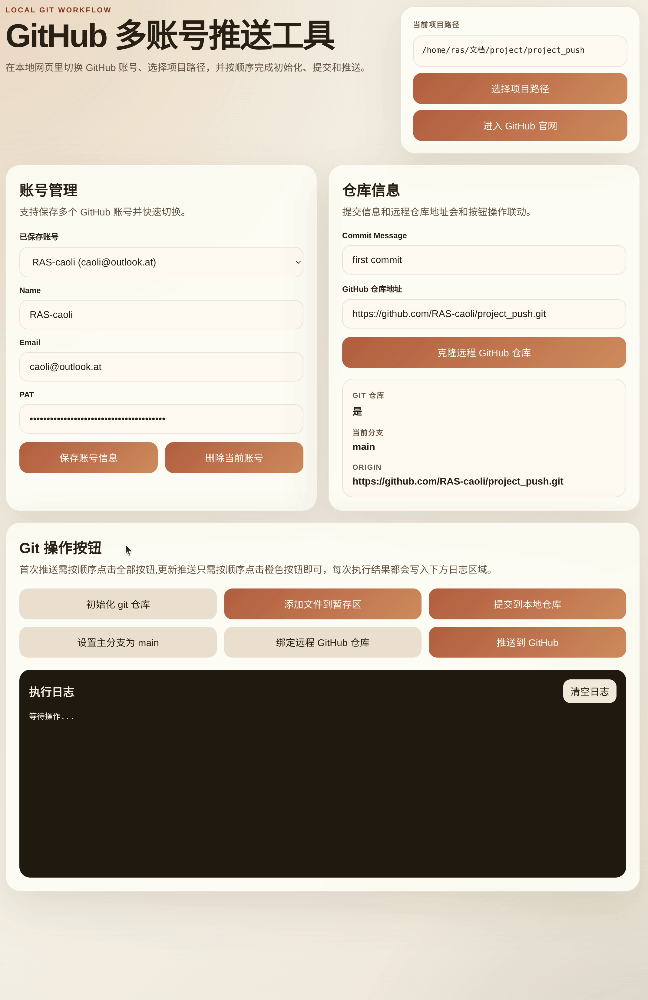

# GitHub 多账号推送工具

这是一个本地运行的 Web 工具，用来在不同 GitHub 账号之间切换，通过按钮完成常见 Git 推送流程：

1. 填写并保存 `name`、`email`、`PAT`
2. `git init`
3. `git add .`
4. `git commit -m "first commit"`
5. `git branch -M main`
6. `git remote add origin 项目地址.git`
7. `git push -u origin main`

它还支持：

- 通过按钮打开系统文件夹选择器，切换当前项目路径
- 在页面中实时显示当前项目路径
- 在 `project_push/data/accounts.json` 中保存多个账号，并一键切换
- 在页面日志区查看每一步 Git 命令执行结果

## 目录结构

```text
project_push/
├─ app.py
├─ data/
│  └─ accounts.json
├─ start_push_tool.ps1
├─ start_push_tool.bat
├─ start_push_tool.sh
├─ .gitignore
└─ web/
   ├─ index.html
   ├─ styles.css
   └─ app.js
```

## 运行方式

### Windows

在 `project_push` 目录中执行：

```powershell
.\start_push_tool.ps1
```

或者直接双击：

```text
start_push_tool.bat
```

默认会启动在：

```text
http://127.0.0.1:8765
```

如果默认端口被占用，脚本会自动切换到后续空闲端口。

### Linux / macOS

```bash
cd /path/to/project_push
bash ./start_push_tool.sh
```

## 页面使用说明

### 1. 保存账号信息

- 在账号卡片中填写 `name`、`email`、`PAT`
- 点击 `保存账号信息`
- 账号会保存到 `project_push/data/accounts.json`
- 切换下拉框即可切换不同 GitHub 账号

说明：

- `name` 对应 Git 提交作者名
- `email` 对应 Git 提交邮箱
- `PAT` 是 GitHub Personal Access Token，用于 HTTPS 推送认证

### 2. 选择项目路径

- 点击 `选择项目路径`
- 系统会弹出文件夹选择器
- 选择需要执行 Git 命令的项目目录
- 当前路径会显示在页面顶部

### 3. 执行 Git 操作

页面中间提供以下按钮：

- `初始化 git 仓库`
- `添加文件到暂存区`
- `提交到本地仓库`
- `设置主分支为 main`
- `绑定远程 GitHub 仓库`
- `推送到 GitHub`

推荐执行顺序：

```text
1 -> 选择账号
2 -> 选择项目路径
3 -> 初始化 git 仓库
4 -> 添加文件到暂存区
5 -> 提交到本地仓库
6 -> 设置主分支为 main
7 -> 绑定远程仓库
8 -> 推送到 GitHub
```

## 认证说明

工具在推送时不会把 PAT 自动写入远程仓库地址，而是使用临时 HTTP 认证头完成 `git push`。

这意味着：

- 页面里填写的 PAT 会保存到 `project_push/data/accounts.json`
- `origin` 地址仍然保持普通 HTTPS 仓库地址
- 不会自动把 token 写进 `.git/config` 的远程 URL 中

## 注意事项

- 这个工具适合在你自己的电脑本地使用
- 页面默认绑定到 `127.0.0.1`，这样更适合处理 PAT
- `project_push/data/accounts.json` 中包含明文 PAT，请不要把这个文件提交到公开仓库
- 如果项目目录还不是 Git 仓库，请先执行 `初始化 git 仓库`
- 如果 `origin` 已存在，绑定远程仓库会自动修改为设置的 GitHub 仓库地址
- 提交时会自动把当前选中账号的 `name` 和 `email` 写入该仓库的本地 Git 配置

## 常见问题

### 1. 点击选择路径没有弹窗

当前版本使用 Python 的系统文件夹选择器。如果系统环境缺少图形界面组件，可能无法弹窗。

### 2. 推送失败

请重点检查：

- PAT 是否有效
- PAT 是否具备仓库写入权限
- 远程仓库地址是否正确
- 当前网络是否能访问 GitHub

### 3. commit 失败

如果没有暂存文件，`git commit` 会失败。这是 Git 正常行为，请先执行 `git add .`。

## 开发说明

后端使用 Python 标准库实现：

- `http.server` 提供本地 Web 服务
- `subprocess` 执行 Git 命令
- `tkinter` 打开系统文件夹选择器
- `json` 负责读写 `data/accounts.json`

前端是原生 HTML + CSS + JavaScript，无需额外安装依赖。

## 使用演示


